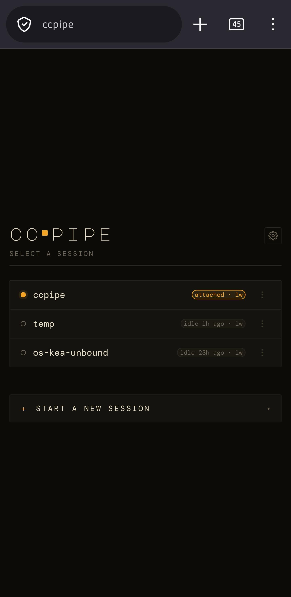
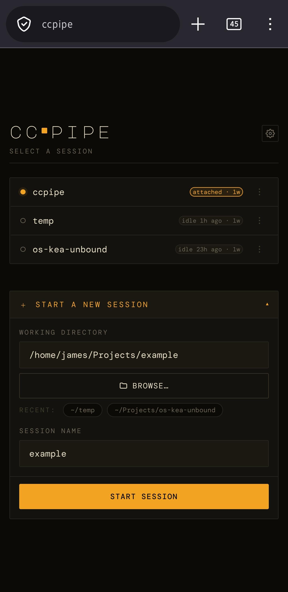
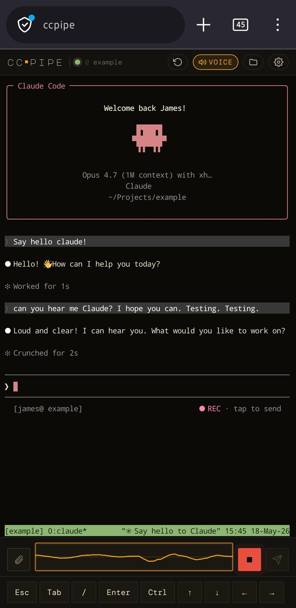
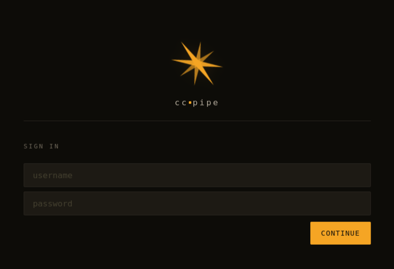
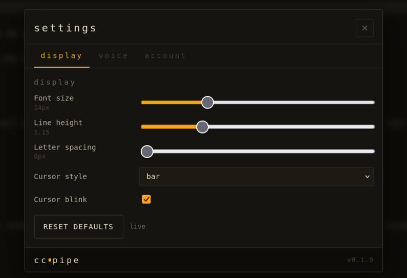
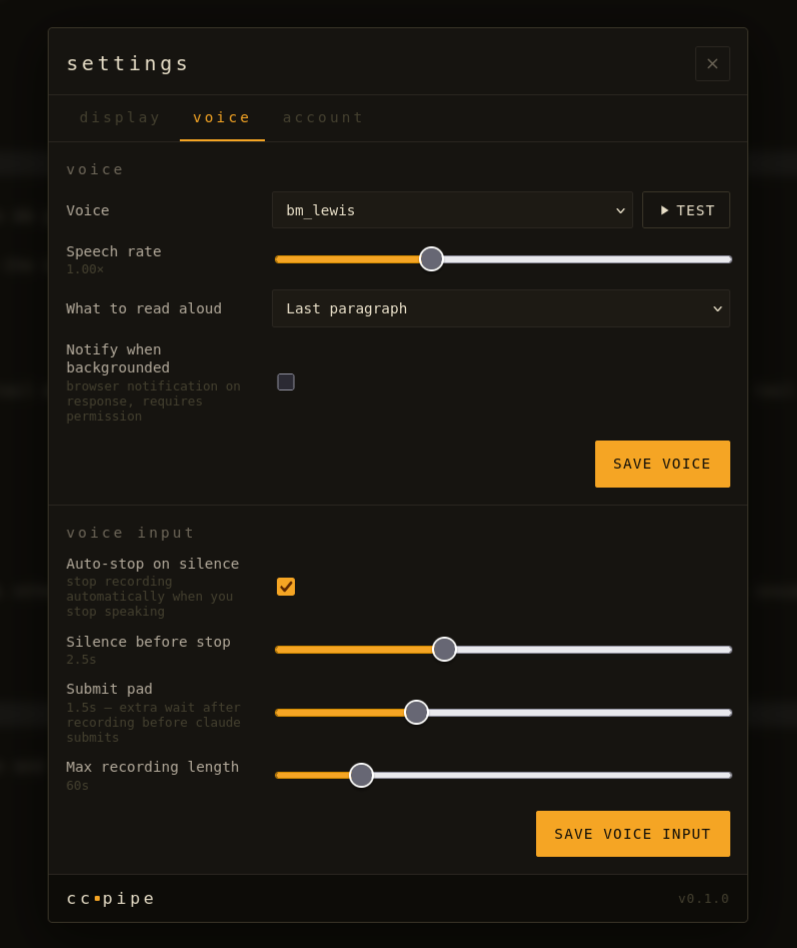
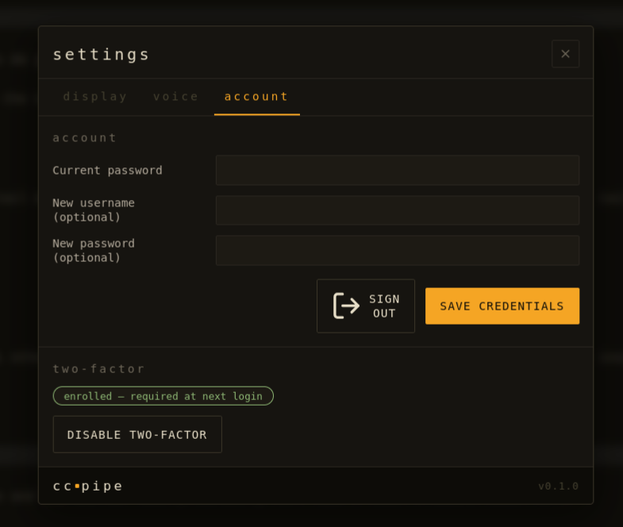

# ccpipe

<p align="center">
  
</p>

ccpipe is a web front-end for [Claude Code](https://claude.com/claude-code)
sessions running in tmux. Install it on the workstation, server, or VM
where you already run `claude` from a terminal; ccpipe attaches a
browser tab to that same tmux session over a WebSocket.

Real-world example: a headless dev VM in a homelab — no monitor, no
soundcard, no microphone. SSH in once to start `claude` inside tmux,
then `systemctl --user start ccpipe`. From then on, opening
`https://your-host` on a phone or laptop gives you the live terminal:
keystrokes, scrollback, `/voice` dictation, spoken replies. The VM
needs no audio hardware — the microphone is a software-only Pulse
pipe-source that ccpipe writes PCM into, and TTS plays back in the
browser.

Terminal stack unchanged: tmux owns the session, xterm.js renders it,
the unmodified `claude` CLI does the API work. ccpipe is the bridge in
the middle.

## What it looks like

Mobile (PWA, installable to the home screen):

<table>
<tr>
<td align="center"></td>
<td align="center"></td>
<td align="center"></td>
</tr>
<tr>
<td align="center"><sub>Pick an existing tmux session…</sub></td>
<td align="center"><sub>…or start a new one in any directory…</sub></td>
<td align="center"><sub>…then drive it by keyboard or voice.</sub></td>
</tr>
</table>

Desktop:

<table>
<tr>
<td align="center"></td>
<td align="center"></td>
</tr>
<tr>
<td align="center"><sub>Login</sub></td>
<td align="center"><sub>Display — font, line height, cursor</sub></td>
</tr>
<tr>
<td align="center"></td>
<td align="center"></td>
</tr>
<tr>
<td align="center"><sub>Voice (TTS) + voice-input timings</sub></td>
<td align="center"><sub>Account + two-factor (TOTP)</sub></td>
</tr>
</table>

## Architecture

ccpipe runs as a `systemd --user` service on the host. No Docker — the
backend is tightly coupled to host state (tmux, `~/.claude`, project
files, PulseAudio, mic pipe) and containerising it created more
friction than it solved.

```
[Browser] ──WSS── [nginx] ── [uvicorn (user service)]
                                   │
                                   ├── tmux client (talks to user's tmux server)
                                   ├── /tmp/ccpipe_mic.pipe (Pulse pipe-source)
                                   └── watches ~/.claude/projects/*.jsonl → Kokoro
```

## Prereqs

- Python 3.11+
- Node 20+ (frontend build only)
- `tmux` on PATH
- `claude` CLI installed and logged in (`claude` once interactively to
  complete OAuth)
- nginx or Caddy for TLS termination (sample in `nginx/ccpipe.conf`)
- PulseAudio or PipeWire (only needed for voice)

## Platform support

The server side has been built for and tested on **Linux**. The
browser client works on any modern browser (Linux, macOS, Windows,
Android, iOS) — that side is OS-agnostic.

| Target | Server-side status |
|---|---|
| Linux | Fully tested, this is what's actively used. |
| Windows via WSL2 | Should work — see below. Not tested by the maintainer; reports welcome. |
| Windows (native) | Not supported. Use WSL2 — a native port would have to replace systemd, the FIFO mic, PulseAudio, and the bash install script. |
| macOS | Supported — launchd LaunchAgent + local whisper-cpp transcription for voice. See [`docs/macos.md`](docs/macos.md). |

### Windows (via WSL2)

Install WSL2 with a recent Linux distro from an elevated PowerShell:

```powershell
wsl --install                        # default Ubuntu
# or: wsl --install -d Debian
```

Reboot, open the Linux shell, then follow the [Linux install steps](#install)
inside it. WSL2 on current Windows builds supports `systemd --user`
(may need `systemd=true` under `[boot]` in `/etc/wsl.conf`) and
PulseAudio via WSLg. The browser on the Windows side connects to
`http://localhost:8080` (port-forwarded from WSL2 by default) or
whichever address you put behind a reverse proxy. Voice in/out across
the WSLg audio boundary hasn't been verified end-to-end — if you try
it, please report back.

### macOS

ccpipe runs as a `launchd` LaunchAgent under `~/Library/LaunchAgents/`.
Voice works differently than on Linux — `claude`'s built-in `/voice`
has had an unfixed regression on macOS for months (see [anthropics/claude-code#38690](https://github.com/anthropics/claude-code/issues/38690)),
so ccpipe transcribes locally via [whisper-cpp](https://github.com/ggerganov/whisper.cpp)
and types the result into the PTY. No virtual audio device or
Microphone-permission-on-the-terminal-app dance needed.

Prereqs:

```bash
brew install python@3.11 node tmux whisper-cpp
brew install --cask claude-code   # if not already
```

Then follow the standard [Install](#install) steps below. `install.sh`
detects macOS, renders a launchd plist, and downloads the whisper
base.en model (~148 MB, one-time). The full design, troubleshooting,
and config knobs live in [`docs/macos.md`](docs/macos.md).

## Install

Install into the home directory of the user ccpipe should run as —
it runs as a `systemd --user` service and needs read/write access to
that user's `~/.claude`, tmux server, and Pulse socket. The conventional
location is `~/.local/share/ccpipe` (under `$XDG_DATA_HOME`); the
installer is path-independent and bakes whichever directory you clone
into.

```bash
git clone https://github.com/<you>/ccpipe ~/.local/share/ccpipe
cd ~/.local/share/ccpipe
scripts/install.sh
```

The installer creates a self-contained Python venv under `backend/.venv`,
builds the frontend bundle, renders the systemd unit templates with the
current install location, and wires up the two `systemd --user` units.
Idempotent: re-run to upgrade.

Skip the systemd step on a dev box with `scripts/install.sh
--skip-units`. See [`docs/development.md`](docs/development.md) for a
fully manual setup and the dev workflow.

> First-run gotcha: if `ccpipe-virtual-mic.service` fails because
> `/tmp/ccpipe_mic.pipe` exists as a *directory* (leftover from a Docker
> bind-mount in a previous install), clean it up with
> `sudo rmdir /tmp/ccpipe_mic.pipe && systemctl --user restart
> ccpipe-virtual-mic`.

Check it's running:

```bash
systemctl --user status ccpipe
journalctl --user -u ccpipe -f
curl http://127.0.0.1:8080/api/health    # should print {"status":"ok"}
```

Then grab the initial password and log in:

```bash
cat ~/.local/state/ccpipe/initial_password.txt
shred -u ~/.local/state/ccpipe/initial_password.txt   # after reading
```

## Putting it on the internet

ccpipe runs HTTP only — terminate TLS in front of it with nginx or
Caddy. See [`docs/deployment.md`](docs/deployment.md) for the full
reverse-proxy + TLS + firewall recipe (off-host and same-host
topologies, the `CCPIPE_BEHIND_TLS=1` drop-in, what `--proxy-headers`
buys you, and the common gotchas).

The short version: edit `nginx/ccpipe.conf`, install the bundled
systemd drop-in template with `CCPIPE_BEHIND_TLS=1` and a tight
`--forwarded-allow-ips=<your-proxy-IP>`, and firewall `:8080` to the
proxy host.

## More

- [`docs/configuration.md`](docs/configuration.md) — env-var reference,
  voice setup, voice-input timing knobs, where state lives.
- [`docs/deployment.md`](docs/deployment.md) — reverse proxy, TLS, the
  systemd drop-in, troubleshooting.
- [`docs/development.md`](docs/development.md) — dev workflow, layout,
  WebSocket protocol, tests.
- [`docs/debugging.md`](docs/debugging.md) — diagnostic playbook for
  the PTY → WebSocket byte stream (the "gap until I refresh" class
  of symptom): journal stats, live counter endpoint, regression
  tests, reproducer recipe.
- [`docs/threat-model.md`](docs/threat-model.md) — design-level threat
  model (post-pen-test).
- [`SECURITY.md`](SECURITY.md) — reporting vulnerabilities.

## Security / ToS notes

- **Pure PTY relay.** Subscription OAuth (Pro/Max) is fine for personal
  use **only** because the unmodified `claude` binary makes the API
  calls — ccpipe never originates a request to `api.anthropic.com`.
  See https://code.claude.com/docs/en/legal-and-compliance.
- **Always-on auth.** Passwords are argon2id-hashed on disk; the
  plaintext only ever exists in the read-once `initial_password.txt`
  sidecar (`0400`). Optional TOTP under Settings → Account.
- **Session hardening.** Signed session cookie with `Secure` +
  `__Host-` prefix under `CCPIPE_BEHIND_TLS=1`; WebSocket Origin
  allow-list; CSRF defence via `X-Requested-By: ccpipe`; per-WS pong
  re-checks auth so credential changes close open sockets.
- **Login throttling.** Per-IP 5/min + global 30/min sliding window
  with a 1 s sleep on failure. No persistent banning — fail2ban reading
  `journalctl --user -u ccpipe` is the conventional add-on.
- **File panel scope.** `/api/fs/*` is jailed to `CCPIPE_FS_ROOT`
  (default `$HOME`). The jail enforces `Path.is_relative_to(root)`
  after symlink resolution, refuses non-regular files, and uses
  `O_NOFOLLOW` on temp-file opens. Only ccpipe's own state dirs are
  denylisted; `.ssh`, `.aws`, `.gnupg`, `.kube`, etc. remain reachable
  because this is an admin tool.
- **TTS reads your Claude transcripts.** Only run ccpipe on a host
  where you trust everyone with access to those files.
- **0.0.0.0 bind.** Required for an off-host proxy; firewall `:8080`
  accordingly. The startup banner reminds you when `CCPIPE_BEHIND_TLS=1`
  is set.

Full design-level threat model in
[`docs/threat-model.md`](docs/threat-model.md); vulnerability
reporting in [`SECURITY.md`](SECURITY.md).
